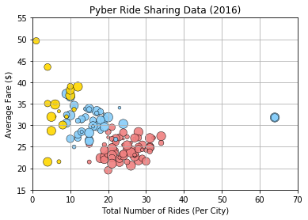
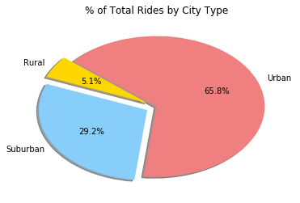

## Pyber Ride Sharing

### Analysis
* will add soon

```python
from matplotlib import pyplot as plt
import numpy as np
import pandas as pd

city_df = pd.read_csv("city_data.csv")
ride_df = pd.read_csv("ride_data.csv")

df = ride_df.merge(city_df)
df.head()
```


<div>
<style>
    .dataframe thead tr:only-child th {
        text-align: right;
    }

    .dataframe thead th {
        text-align: left;
    }

    .dataframe tbody tr th {
        vertical-align: top;
    }
</style>
<table border="1" class="dataframe">
  <thead>
    <tr style="text-align: right;">
      <th></th>
      <th>city</th>
      <th>date</th>
      <th>fare</th>
      <th>ride_id</th>
      <th>driver_count</th>
      <th>type</th>
    </tr>
  </thead>
  <tbody>
    <tr>
      <th>0</th>
      <td>Sarabury</td>
      <td>2016-01-16 13:49:27</td>
      <td>38.35</td>
      <td>5403689035038</td>
      <td>46</td>
      <td>Urban</td>
    </tr>
    <tr>
      <th>1</th>
      <td>Sarabury</td>
      <td>2016-07-23 07:42:44</td>
      <td>21.76</td>
      <td>7546681945283</td>
      <td>46</td>
      <td>Urban</td>
    </tr>
    <tr>
      <th>2</th>
      <td>Sarabury</td>
      <td>2016-04-02 04:32:25</td>
      <td>38.03</td>
      <td>4932495851866</td>
      <td>46</td>
      <td>Urban</td>
    </tr>
    <tr>
      <th>3</th>
      <td>Sarabury</td>
      <td>2016-06-23 05:03:41</td>
      <td>26.82</td>
      <td>6711035373406</td>
      <td>46</td>
      <td>Urban</td>
    </tr>
    <tr>
      <th>4</th>
      <td>Sarabury</td>
      <td>2016-09-30 12:48:34</td>
      <td>30.30</td>
      <td>6388737278232</td>
      <td>46</td>
      <td>Urban</td>
    </tr>
  </tbody>
</table>
</div>


```python
average_fare = df.groupby("city")["fare"].mean().to_frame().reset_index()
ride_count = df.groupby("city")["ride_id"].count().to_frame().reset_index()
sub_df = average_fare.merge(ride_count)
sub_df = sub_df.rename(columns={"fare":"average_fare", "ride_id":"ride_count"})

new_df = city_df.merge(sub_df)
urban_data = new_df[new_df["type"] == "Urban"]
suburban_data = new_df[new_df["type"] == "Suburban"]
rural_data = new_df[new_df["type"] == "Rural"]

plt.grid()
plt.scatter(urban_data["ride_count"], urban_data["average_fare"], s=urban_data["driver_count"]*2, color="lightcoral", alpha=0.9, edgecolor='black', label="Urban", linewidths=0.5)
plt.scatter(suburban_data["ride_count"], suburban_data["average_fare"], s=urban_data["driver_count"]*2, color="lightskyblue", alpha=0.9, edgecolor='black', label="Suburban", linewidths=0.5)
plt.scatter(rural_data["ride_count"], rural_data["average_fare"], s=urban_data["driver_count"]*2, color="gold", alpha=0.9, edgecolor='black', label="Rural", linewidths=0.5)

plt.xlim(0, 70)
plt.ylim(15, 55)
plt.xlabel("Total Number of Rides (Per City)")
plt.ylabel("Average Fare ($)")
plt.title("Pyber Ride Sharing Data (2016)")
# plt.legend(handles=, loc="best")

plt.show()

```





```python
total_fare = df.groupby("type")["fare"].sum()

plt.pie(total_fare.values, explode=(0.1,0.1,0), labels=["Rural", "Suburban", "Urban"], colors=["gold","lightskyblue","lightcoral"],
        autopct="%1.1f%%", shadow=True, startangle=140)
plt.title("% of Total Fares by City Type")

plt.show()
```


```python
ride_count = new_df.groupby("type")["ride_count"].sum()

plt.pie(ride_count.values, explode=(0.1,0.1,0), labels=["Rural", "Suburban", "Urban"], colors=["gold","lightskyblue","lightcoral"],
        autopct="%1.1f%%", shadow=True, startangle=140)
plt.title("% of Total Rides by City Type")

plt.show()
```





```python
driver_count = new_df.groupby("type")["driver_count"].sum()

plt.pie(driver_count.values, explode=(0.1,0.1,0), labels=["Rural", "Suburban", "Urban"], colors=["gold","lightskyblue","lightcoral"],
        autopct="%1.1f%%", shadow=True, startangle=140)
plt.title("% of Total Drivers by City Type")

plt.show()
```


