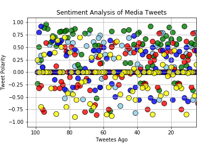
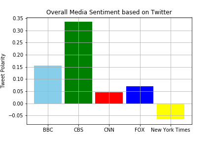

## Social Analytics (News Mood)  -  Yeon Sung

### Analysis 
#### Note: below analysis is based on the data collected at the time the script was run
* Most Tweets have neutral sentiment score
* CBS has the highest score tweet polarity score and scatter graph shows that many of tweets published by CBS has score above 0
* Only New York Times has negative overall tweet polarity score, and others have positive overall tweet polarity but close to neutral


```python
import tweepy
import json
import numpy as np
import pandas as pd
from matplotlib import pyplot as plt
from vaderSentiment.vaderSentiment import SentimentIntensityAnalyzer
analyzer = SentimentIntensityAnalyzer()
```


```python
consumer_key = "Ed4RNulN1lp7AbOooHa9STCoU"
consumer_secret = "P7cUJlmJZq0VaCY0Jg7COliwQqzK0qYEyUF9Y0idx4ujb3ZlW5"
access_token = "839621358724198402-dzdOsx2WWHrSuBwyNUiqSEnTivHozAZ"
access_token_secret = "dCZ80uNRbFDjxdU2EckmNiSckdoATach6Q8zb7YYYE5ER"

auth = tweepy.OAuthHandler(consumer_key, consumer_secret)
auth.set_access_token(access_token, access_token_secret)
api = tweepy.API(auth, parser=tweepy.parsers.JSONParser())
```


```python
target_media = ("@BBC", "@CBS", "@CNN", "@FoxNews", "@nytimes")
```


```python
compound_list = []
positive_list = []
negative_list = []
neutral_list = []
tweet_source_list = []
tweet_text_list = []
tweet_date_list = []
tweet_count_list = []

for media in target_media:
    count = 0
    
    # Pull last 100 tweets from each outlet.
    for x in range(5):
        public_tweets = api.user_timeline(media, page=x)
        for tweet in public_tweets:
            tweet_text = tweet["text"]
            
            #Perform a sentiment analysis with the compound, positive, neutral, and negative scoring for each tweet.
            compound = analyzer.polarity_scores(tweet_text)["compound"]
            pos = analyzer.polarity_scores(tweet_text)["pos"]
            neu = analyzer.polarity_scores(tweet_text)["neu"]
            neg = analyzer.polarity_scores(tweet_text)["neg"]

            tweet_source_list.append(media)
            tweet_text_list.append(tweet_text)
            tweet_date_list.append(tweet["created_at"])
            tweet_count_list.append(count)
            compound_list.append(compound)
            positive_list.append(pos)
            negative_list.append(neg)
            neutral_list.append(neu)
            count = count + 1

#Pull into a DataFrame the tweet's source acount, its text, its date, 
#and its compound, positive, neutral, and negative sentiment scores.

df = pd.DataFrame({
    "Source": tweet_source_list,
    "Text": tweet_text_list,
    "Date": tweet_date_list,
    "Compound Score": compound_list,
    "Positive Score": positive_list,
    "Neutral Score": neutral_list,
    "Negative Score": negative_list,
    "Tweets Ago": tweet_count_list
})

#Export the data in the DataFrame into a CSV file.
df.to_csv("social_analytics.csv")

bbc_data = df[df["Source"] == "@BBC"]
cbs_data = df[df["Source"] == "@CBS"]
cnn_data = df[df["Source"] == "@CNN"]
fox_data = df[df["Source"] == "@FoxNews"]
nytimes_data = df[df["Source"] == "@nytimes"]
```


```python
fig = plt.figure()
plt.grid()
plt.scatter(bbc_data["Tweets Ago"], bbc_data["Compound Score"], color="skyblue", alpha=0.8, edgecolor='black', label="BBC", s=100)
plt.scatter(cbs_data["Tweets Ago"], cbs_data["Compound Score"], color="green", alpha=0.8, edgecolor='black', label="CBS", s=100)
plt.scatter(cnn_data["Tweets Ago"], cnn_data["Compound Score"], color="red", alpha=0.8, edgecolor='black', label="CNN", s=100)
plt.scatter(fox_data["Tweets Ago"], fox_data["Compound Score"], color="blue", alpha=0.8, edgecolor='black', label="Fox", s=100)
plt.scatter(nytimes_data["Tweets Ago"], nytimes_data["Compound Score"], color="yellow", alpha=0.8, edgecolor='black', label="New York Times", s=100)

plt.xlim(105, 5)
plt.ylim(-1.1, 1.1)
plt.xlabel("Tweetes Ago")
plt.ylabel("Tweet Polarity")
plt.title("Sentiment Analysis of Media Tweets")

fig.savefig('social_analytics_1.png')
plt.show()
```





```python
bbc_polarity = bbc_data["Compound Score"].mean()
cbs_polarity = cbs_data["Compound Score"].mean()
cnn_polarity = cnn_data["Compound Score"].mean()
fox_polarity = fox_data["Compound Score"].mean()
nytimes_polarity = nytimes_data["Compound Score"].mean()
```


```python
fig, ax = plt.subplots()
ind = np.arange(1, 6)

bbc, cbs, cnn, fox, nytimes = plt.bar(ind, [bbc_polarity, cbs_polarity, cnn_polarity, fox_polarity, nytimes_polarity], align='center', width=0.9)
bbc.set_facecolor('skyblue')
cbs.set_facecolor('r')
cnn.set_facecolor('g')
fox.set_facecolor('b')
nytimes.set_facecolor('yellow')
ax.set_xticks(ind)
ax.set_xticklabels(['BBC', 'CBS', 'CNN', 'FOX', 'New York Times'])
ax.set_ylabel('Tweet Polarity')
ax.set_title('Overall Media Sentiment based on Twitter')
plt.grid()

fig.savefig('social_analytics_2.png')
plt.show()
```




