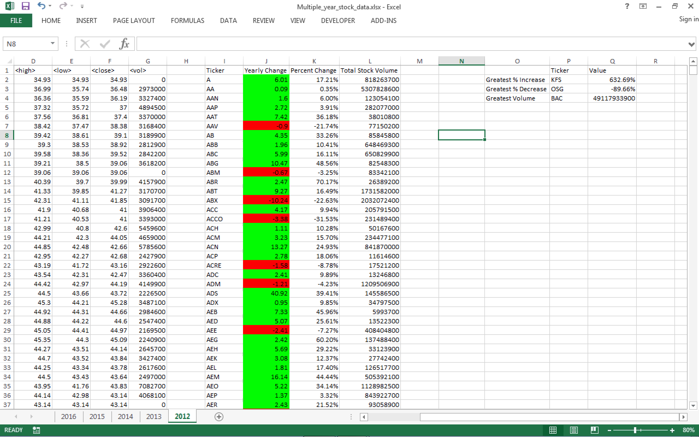
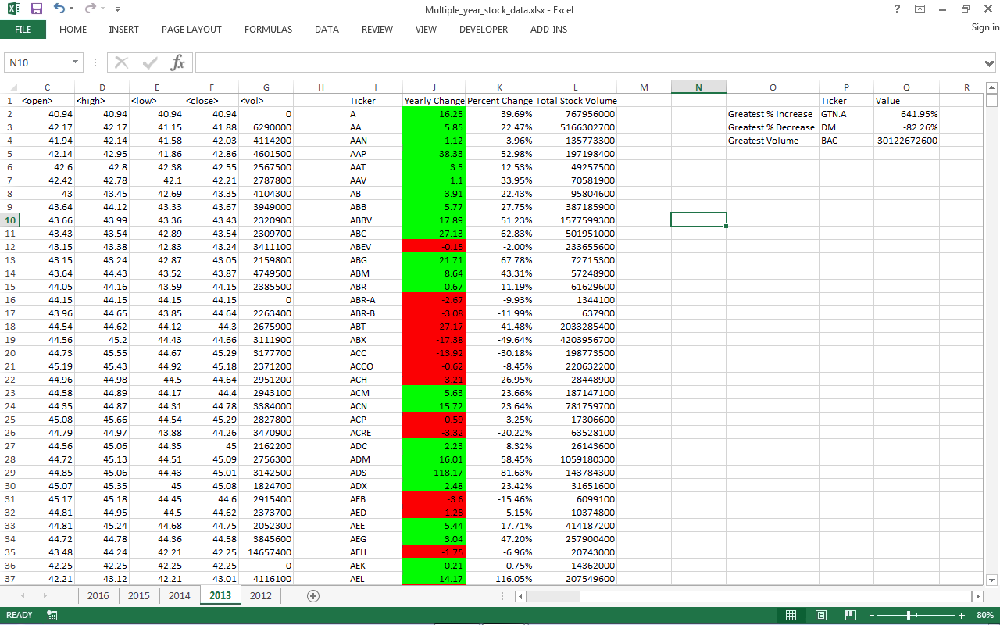
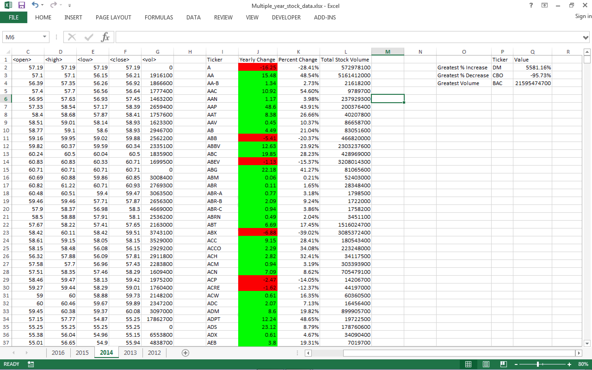
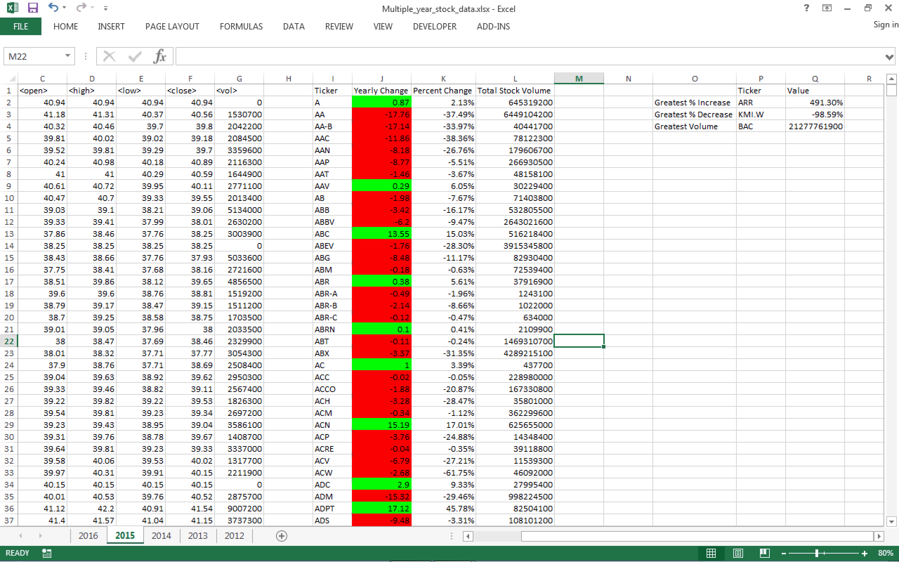
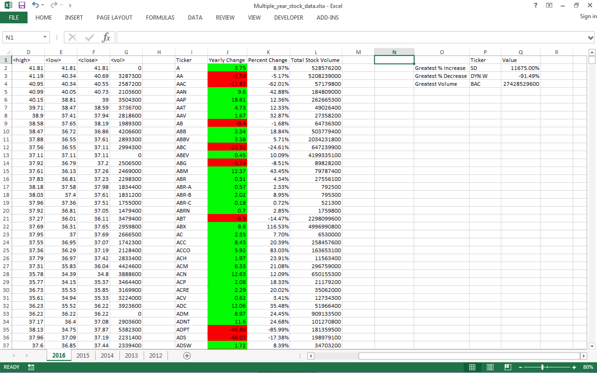

# Homework Assignment #2

### 2012 Result


### 2013 Result


### 2014 Result


### 2015 Result


### 2016 Result


### Visual Basic
```vbs
Sub SummaryReport()
  'Variables
  Dim Ticker As String
  Dim YearlyChange As Double
  Dim PercentChange As Double
  Dim TotalVolume As Double
  Dim openValue As Double
  Dim closeValue As Double
  Dim outputIndex As Integer
  Dim greatestIncrease As Double
  Dim greatestDecrease As Double
  Dim greatestVolume As Double
  
  For Each ws In Worksheets
    'Variable Initialization
    outputIndex = 2
    TotalVolume = 0
    openValue = ws.Cells(2, 3).Value
    lastRow = ws.Cells(Rows.Count, 1).End(xlUp).Row
    greatestIncrease = -9999
    greatestDecrease = 9999
    greatestVolume = 0

    'Print Headers
    ws.Cells(1, 9).Value = "Ticker"
    ws.Cells(1, 10).Value = "Yearly Change"
    ws.Cells(1, 11).Value = "Percent Change"
    ws.Cells(1, 12).Value = "Total Stock Volume"
      
    For i = 2 To lastRow
      If ws.Cells(i + 1, 1).Value <> ws.Cells(i, 1).Value Then
        Ticker = ws.Cells(i, 1).Value
        closeValue = ws.Cells(i, 6).Value
        YearlyChange = closeValue - openValue
        
        'Preventing division by 0 (there is one case 2014 PLNT)
        If openValue <> 0 Then
          PercentChange = YearlyChange / openValue
        Else
          PercentChange = 0
        End If
        TotalVolume = TotalVolume + ws.Cells(i, 7).Value

        'Print Result
        ws.Cells(outputIndex, 9).Value = Ticker
        ws.Cells(outputIndex, 10).Value = YearlyChange
        ws.Cells(outputIndex, 11).Value = PercentChange
        ws.Cells(outputIndex, 12).Value = TotalVolume

        'Format Result
        If YearlyChange < 0 Then
        ws.Cells(outputIndex, 10).Interior.ColorIndex = 3
        Else
        ws.Cells(outputIndex, 10).Interior.ColorIndex = 4
        End If
        ws.Cells(outputIndex, 11).NumberFormat = "0.00%"

        'Reset variables for next ticker
        outputIndex = outputIndex + 1
        TotalVolume = 0
        openValue = ws.Cells(i + 1, 3)
      Else
        TotalVolume = TotalVolume + ws.Cells(i, 7).Value
      End If
    Next i
      
    'Print Header for Hard question
    ws.Cells(1, 16).Value = "Ticker"
    ws.Cells(1, 17).Value = "Value"
    ws.Cells(2, 15).Value = "Greatest % Increase"
    ws.Cells(3, 15).Value = "Greatest % Decrease"
    ws.Cells(4, 15).Value = "Greatest Volume"

    'Cell formatting for Hard question
    ws.Cells(2, 17).NumberFormat = "0.00%"
    ws.Cells(3, 17).NumberFormat = "0.00%"

    'Solution to Hard question
    For j = 2 To outputIndex
      If greatestIncrease < ws.Cells(j, 11).Value Then
        greatestIncrease = ws.Cells(j, 11).Value
        ws.Cells(2, 16).Value = ws.Cells(j, 9).Value
        ws.Cells(2, 17).Value = ws.Cells(j, 11).Value
      End If
      If greatestDecrease > ws.Cells(j, 11).Value Then
        greatestDecrease = ws.Cells(j, 11).Value
        ws.Cells(3, 16).Value = ws.Cells(j, 9).Value
        ws.Cells(3, 17).Value = ws.Cells(j, 11).Value
      End If
      If greatestVolume < ws.Cells(j, 12).Value Then
        greatestVolume = ws.Cells(j, 12).Value
        ws.Cells(4, 16).Value = ws.Cells(j, 9).Value
        ws.Cells(4, 17).Value = ws.Cells(j, 12).Value
      End If
    Next j
    
  Next ws
End Sub
```
